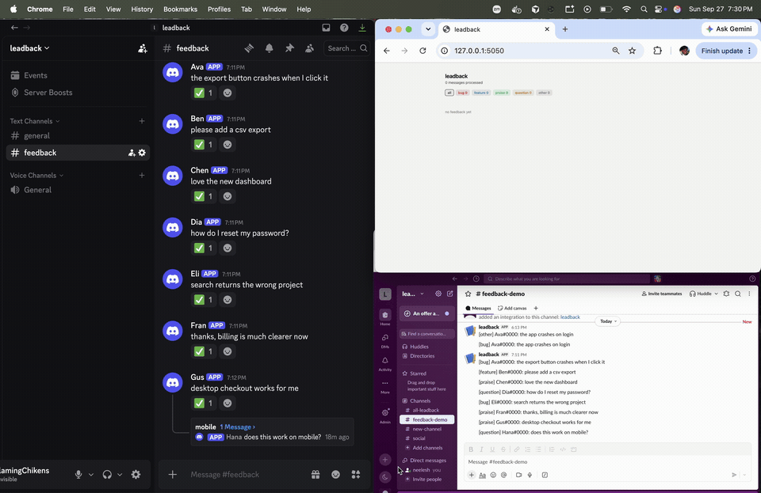

# leadback

Discord feedback bot. Text and voice notes are labeled by an LLM, stored in Redis, and forwarded to Slack and Notion.



```
discord → transcribe (voice) → classify → thread context retry → redis → dashboard / slack / notion
```

Thread replies are reclassified with their parent message:

| message | context | alone | with context |
| --- | --- | --- | --- |
| same on my phone | app crashes every time I upload a photo on iOS | other | bug |

## Run

```bash
cp .env.example .env
pip install -r requirements.txt
docker compose up -d
python bot/main.py
python api/app.py   # localhost:5050
```

Needs the Message Content intent enabled on the Discord bot.
